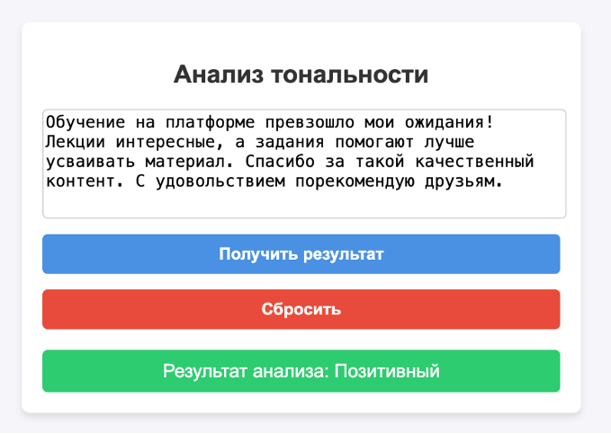
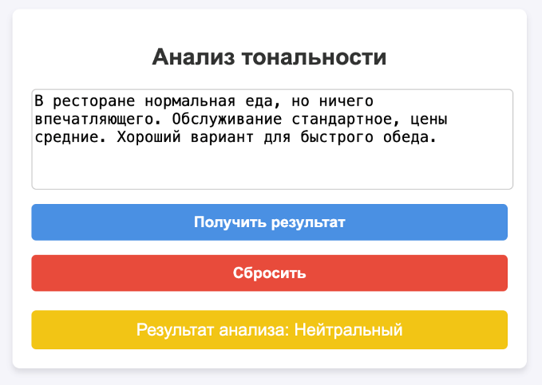
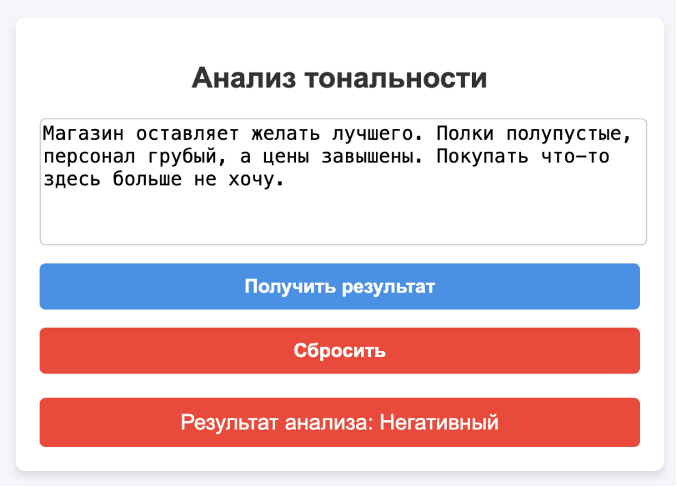

# SentimentAnalyzer

## Описание проекта
SentimentAnalyzer – это веб-приложение для анализа тональности пользовательских текстов. Оно позволяет загружать текст, выполнять его предобработку и определять эмоциональную окраску (положительную, отрицательную или нейтральную).

Проект использует нейросетевые модели, обученные на датасетах с платформы Hugging Face. Веб-интерфейс реализован с помощью Django, а для работы с данными применяются TensorFlow, Keras, Pandas и NumPy.

## Требования
- Python 3.12.5 (или совместимая версия)
- Django
- TensorFlow
- Keras
- Pandas
- NumPy

## Установка и запуск

### 1. Клонирование репозитория
```sh
 git clone https://github.com/asyanix/SentimentAnalyzer.git
 cd SentimentAnalyzer
```

### 2. Создание и активация виртуального окружения
Рекомендуется использовать виртуальное окружение, чтобы избежать конфликтов библиотек.

#### Для Mac и Linux:
```sh
python3 -m venv venv
source venv/bin/activate
```

#### Для Windows (cmd):
```sh
python -m venv venv
venv\Scripts\activate
```

### 3. Установка зависимостей
```sh
pip install -r requirements.txt
```

### 4. Запуск веб-приложения
```sh
python manage.py runserver
```
После запуска сервер будет доступен по адресу: `http://127.0.0.1:8000/`

## Использование
1. Перейдите в веб-интерфейс по указанному выше адресу.
2. Введите текст в соответствующее поле.
3. Получите результат анализа тональности.

## Пример работы

Положительный результат:


Нейтральный результат:


Негативный результат:
